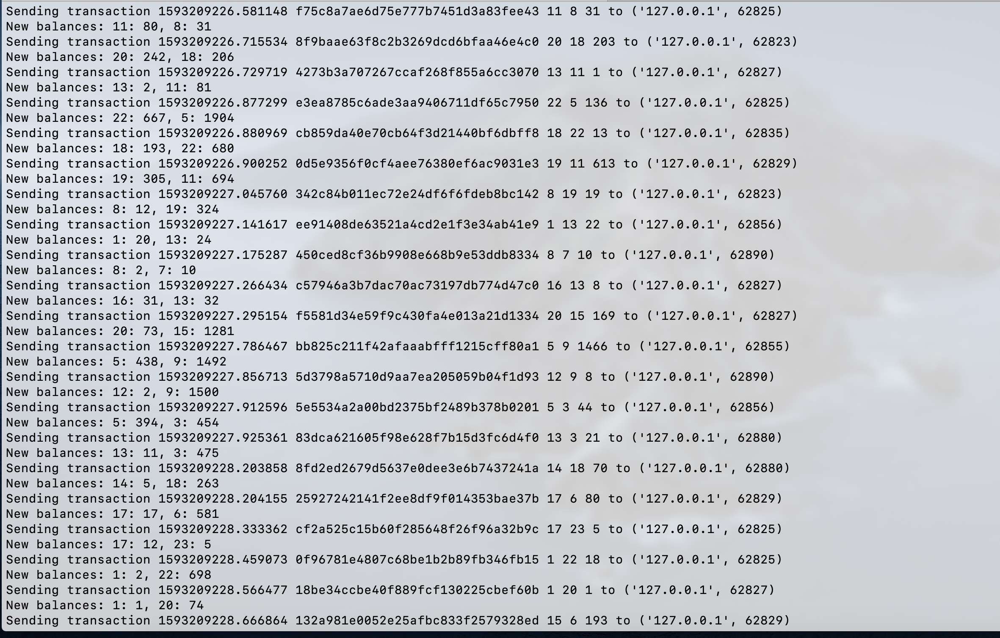
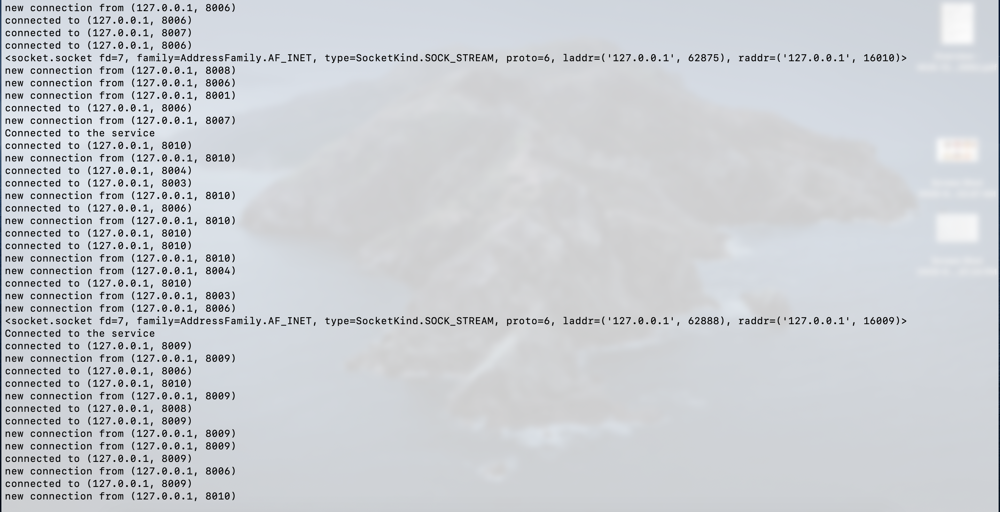
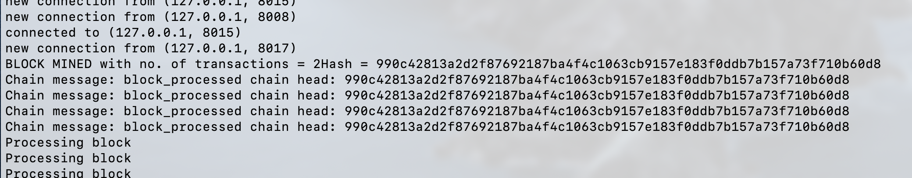

# Blockchain
This is a stab at making a basic blockchain using some features from Bitcoin such as gossip to deliver messages and proof-of-work. 

# Service
There is a file called "service.py", run using python3 service.py <portnumber> <txns per second>. By default, port 5555 should be used. This file provides randomly created transactions to each of the nodes in the network, one at a time. 

###### A screenshot of the service

  
# Node
"node.py" runs a node on the network that talks to the service and mines the block. It is run using a starter bash script called "start_multiple_nodes". 

###### Some screenshots of the nodes

